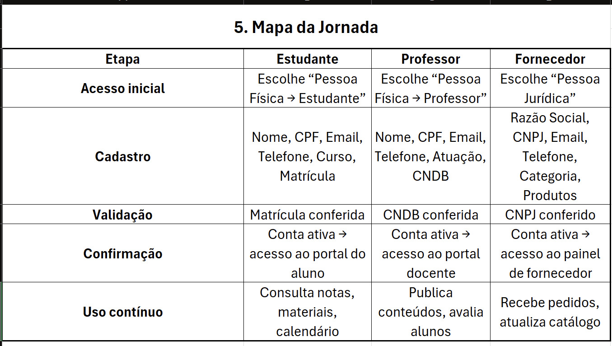

## Protótipos Jornadas

#### 1. Entrada no sistema
• Login ou Registro:
• Usuário acessa a página inicial do sistema da escola.
• Opções: Entrar com conta existente ou Criar nova conta.
• Escolha entre Pessoa Física (professor/estudante) ou Pessoa Jurídica (fornecedor).

#### 2. Fluxo de cadastro – Pessoa Física
• Seleção de perfil:
• Usuário escolhe se deseja registrar-se como Estudante ou Professor.
• Formulário de cadastro:
• Campos básicos: Nome, CPF, Email, Telefone.
• Campos específicos:
• Estudante: Curso + Número de matrícula.
• Professor: Área de atuação + Carteira Nacional Docente (CNDB).
• Validação: sistema verifica consistência dos dados (ex.: matrícula existente, CNDB válida).
• Confirmação: conta criada e vinculada ao sistema escolar.

#### 3. Fluxo de cadastro – Pessoa Jurídica (Fornecedor)
• Seleção de perfil: fornecedor de insumos escolares.
• Formulário de cadastro:
• Campos: Razão Social, CNPJ, Email, Telefone.
• Campos adicionais: Categoria de fornecimento + Lista de produtos.
• Validação: checagem automática de CNPJ e consistência dos dados.
• Confirmação: fornecedor passa a ter acesso ao painel de gestão de produtos e pedidos da escola.

#### 4. Cenários de uso
• Estudante: acessa disciplinas, notas, materiais e interações com professores.
• Professor: gerencia turmas, publica conteúdos, acompanha desempenho dos alunos.
• Fornecedor: cadastra insumos (livros, materiais, uniformes), recebe pedidos da escola e atualiza estoque.

#### 6. Evidências de pesquisa

• Necessidade de simplicidade: formulários curtos e diretos reduzem abandono.
• Personalização por perfil: cada tipo de usuário precisa de campos específicos.
• Fluxo ponta a ponta: desde login até confirmação, sem etapas redundantes.
• Validação automática: evita erros e garante confiabilidade dos cadastros.

## Modelo de Dados (Banco SQL)  
• O modelo de dados do sistema foi elaborado com base na modelagem UML desenvolvida na Fase 1, a qual está disponível para consulta na pasta `/documentacao` deste repositório.
• Os scripts e diagramas encontram-se disponíveis na pasta `/modelo_dados` deste repositório.

## Protótipo Interface (Figma)
• O protótipo da interface foi elaborado conforme as diretrizes definidas na Fase 1.
• As interfaces e seus respectivos links estão disponíveis na pasta `/prototipos_interface`.